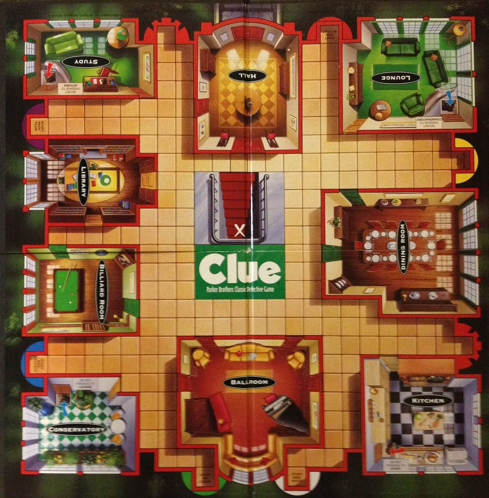

# Plum

A logical agent for the board-game *Clue*.

> Plum was developed as an undergrad term project in Artificial Intelligence. Plum uses path-finding and fuzzy logic for decision making, models knowledge as a constraint satisfaction problem, and communicates with a human operator in natural language. The document below is a report detailing Plum and its success against human opponents.


## Abstract

Plum is a backwards-chaining logical agent for *Clue* incorporating certainty factors, constraint satisfaction techniques, and a declarative, natural-language interface. The goal of *Clue* is to be the first to identify three hidden cards, knowing that the rest of the cards are distributed among the players hands. The agent represents its knowledge as a set of constraint variables representing the possible value of each card. Events in the game reveal more constraints that must exist on the cards. As the game proceeds, the agent applies these constraints until it can narrow down the solution to a given certainty level and make an accusation. (Plum was only tested using 100% certainty.) When Plum must make an action, it consults a rule-based system that considers certainty levels for the possible solutions and the location of its character piece on the board. The agent also attempts to minimize the amount of information it leaks from its own hand to improve its odds of winning.


## A Description of *Clue*

*Clue* is an imperfect information game with three to six players. The premise is that a murder has been committed in a mansion by one of six characters using one of six weapons in one of nine rooms. Players take turns in attempts to discover the three pieces of this crime [Hasbro 2002].

At the beginning of the game, a pool of twenty-one cards is partitioned among a hidden case of three cards and hands for each player. Each of the twenty-one cards have printed on them either one of the characters, one of the weapons, or one of the rooms. The hidden case contains exactly one of each of these three classes, representing the murder case. The other eighteen cards are randomly dealt evenly among players. Players take turns making suggestions about what may be in the case. When a player makes a suggestion, the next player must either disprove that possible case by revealing one of the cards in the suggestion to the suggester, or when that is not possible, pass responsibility of disproof onto the next player.

The specific suggestions a player may make is limited by the state of a board game. The board (Fig 1) consists of large, separated areas representing each of the rooms, with the area between the rooms divided as a grid. This represents the mansion in which the murder occurred. A piece modeled after each character is initially placed at specific starting points. Players select one character piece to play with for the duration of the game, and take turns moving their piece around the board. The distance a player can move is determined by a dice roll. Players can only make suggestions when they enter a room on their turn, and their suggestion must include that room. When a character is involved in a suggestion, the corresponding  piece is moved from its existing location into the room of the suggestion. (A novelty piece representing the weapon is moved into the room as well.)



At the end of a player’s turn, they may make an accusation of the case. The player then looks at the three cards in the case. If their accusation is correct, they win, and the game is over. This is the only win condition. Otherwise they put the case cards back and continue playing; however, a player may only make one accusation in a game, necessarily loosing if the accusation is wrong.

Formally, *Clue* is a partially observable, stochastic, turn playing game. Players are only partially aware of the results of their opponents turns, and board state is dependent on random dice rolls [Russell and Norvig 2010].


## Knowledge Representation

The agent uses twenty-one constraint variables that represent the identity of each of the cards. The variables are partitioned exactly as the cards. Each variable is given a domain of [1,21] where each member of the domain corresponds to a specific card. Each variable is constricted to being unique, and each partition is provided a well-ordered constraint to eliminate symmetries in the variable assignments. An additional constraint is placed on the three variables representing the solution, noting that the cards in the solution are from unique classes.

Most events in the game reveal constraints that must exist on the set of cards. The most apparent of such is when an opponent reveals their card to the agent, the agent knows that card exists in that player’s hand. Additionally, when one opponent responds to another opponent’s suggestion, the agent knows that the cards in the suggestion and the cards in the opponent’s hand are either intersecting or non-intersecting sets. Since this knowledge is easily represented in terms of set theory, Plum uses a technique called reification to implement variable constraints for set membership and empty set intersection. Reification is a technique that reflects the success or failure of a constraint as an auxiliary variable in the set {0,1} [Triska 2012]. Reification means the constraints can be easily inverted, and that constraints may be checked on a case-wise basis without reverting to search. This gives the underlying consistency algorithm excellent information. Note that the domain of the reified variable need not be forced to 0 or 1, representing uncertainty.

The auxiliary variable for the set membership check is recursively defined:
- 0 (the item is not a member of the set) if the set is the empty set.
- 1 (the item is a member of the set) iff a particular member of the set is the item being tested, or the set without the particular member contains the item.

Using this member check, I abstracted a rule for checking if the intersection of two sets is empty. The auxiliary variable for this constraint is also recursively defined:
- 1 (the intersection of the sets is empty) if either of the sets the empty set.
- 0 (the intersection of the sets is nonempty) iff a particular member of the first set is a member of the second set, or the intersection of the second set and the first set without the particular member is nonempty.

Given reified versions of the logical operators and identity, set membership and empty intersection can be implemented as reified constraints, allowing the important events in the game to be encoded as constraints.


## Knowledge Acquisition and Human Interface

Plum’s primary precept and actuator is a human operator. The operator inputs declarative sentences describing the events of the game and imperative commands to request the agent to take action. The language is a simple SVO word order language using English vocabulary. The set of verbs known by the agent is finite, but the agent understands the conjugation of those verbs, allowing the operator to refer to the agent in the second person and the opponents in the third person. Prepositional phrases may be appended only at the end of the sentence and modify the verb. Plum understands many nouns, including each of the suspects, weapons, and rooms, distances, player’s names, ordered pairs (referring to cells on the board outside of rooms), and a few other specific nouns. The sentences understood by Plum are:

- **Player** suggests **Suspect** with the **Weapon** in the **Room**.
	- where **Player** is the name of a player, **Suspect** is the name of a suspect, **Weapon** is a weapon, and **Room** is a room. This form of sentence is used to tell the agent which suggestion is made on an opponents turn and is modeled after how players actually announce their suggestions. The prepositional phrases may come in any order.
- **Player** has **Card**.
	- where **Player** is the name of a player and **Card** is either a suspect, a weapon, or a card. These sentences are input whenever a card is revealed to the agent. The form “You have **Card**” is used to tell the agent of its own hand.
- **Player** has a card.
	- where **Player** is the name of a player. This tells the agent that the player has a card from the most recent suggestion, but doesn’t reveal the identity of the card.
- **Player** passes.
	- This tells the agent that a player was unable to disprove the most recent suggestion.
- move **Distance** from **Location**.
	- where **Distance** is an integer and **Location** is either the name of a room or an ordered pair referring to a point on the board. Since the agent cannot roll the dice, the operator rolls and uses these sentences to request the agent make a movement decision.
- show a card.
	- This instructs the agent that it must reveal a card if it can disprove the current suggestion.

The agent responds to the operator in plain English whenever it wishes to perform an action. The natural language interface greatly improves the experience of working with the agent since the operator needs to do very little translating between the words of other players and the language of the agent.


## Decision Making

Plum uses certainty levels to help it make decisions. Certainty is calculated from the set of all possible bindings for the variables representing the case. For each solution, the certainty is the product of the number of solutions containing the suspect, the number of solutions containing the weapon, and the number of solutions containing the room divided by the total number of solutions. The set of possible solutions is found in one of two ways. Early in the game, the set of solutions is found by considering possible bindings for the three cards in the solution. This is quick to find, but might not be fully constrained. Once a certainty greater than 1% is found for a solution, the agent tries a stronger search. In the stronger search, the agent considers bindings for all cards, not just the cards in the solution set. This forces the constraints to propagate to their fullest extent. It is common for the best certainty level to jump from around 1% to around 3% just by switching to the stronger search method.

Sometimes Plum can only make suggestions that it knows are not in the solution. Thus the certainty is 0 for all possible suggestions. In these cases, the agent uses a penalty system to decide what to suggest. If a card is known to be held by the next player, suggestions containing that card are penalized by n where n is the number of players. If a card is known to be held by the player after the next, the penalty is n-1. In general, the penalty is n-x where x is the distance the in terms of turn order from the player known to have that card.

The agent makes movement decisions by considering all possible rooms it can move into and the suggestions that would be allowed. It picks the move that enables the suggestion of the highest certainty. If it cannot move into a room, it finds the path to the room of highest certainty and moves as far along that path as possible.

Finally, the agent must make decisions about which card to show when disproving an opponents suggestion. Plum counts how often it shows each card and always shows the card with the highest count, if there are more than one card it can use to disprove. This limits the amount of information leaking out from the agent’s hand.


## Implementation

Plum is implemented in SWI-Prolog 7. Version seven introduces dictionary terms and method-like predicates that make it easier to manage complex structures.  These features are used heavily, so it is unlikely that Plum will be able to run in other Prolog environments. Note that SWI-Prolog 7 is the current development version. SWI-Prolog 6 is the current stable release, but the required extensions are not available there. The code base includes the language parser, the rule-based agent, an encoding of the board as a graph, and a generic priority queue implementation for path-finding with A*.

The agent makes heavy use of the CLP(FD) library for finite domain constraint problems. The set theoretic constraints are implemented on top of the reifable boolean constraints built-into CLP(FD).

The source code for Plum is available in a public repository at https://github.com/cbarrick/plum.


## Trials

Plum thus far has a 2-0 record against my two roommates. In the first trial, Plum won by a slim margin; one opponent would have know the solution given one more turn. That opponent spent their last turn outside of a room because he did not roll high enough to get into the room he needed. The game came down to a dice roll to see which player made it into the room they needed. In the logs of this game printed in Appendix A, you can see that Plum deduced the entirety of one opponent’s hand on line 213, and lines 180 through 205 shows that Plum eliminated Mrs. Peacock as a suspect without her being mentioned directly in any of the turns in that range.

In the second trial, Plum won by a stroke of luck. Early in the game, Plum made a suggestion that happened to be the solution, highlighting the stochastic nature of the game.


## Conclusions

Plum is competitive against humans. By nature, it reasons out all the implications of an event, possibly involving a deeper search than most casual players attempt. At the very least, it’s reasoning skills are equivalent to a human player. However, plum is not without it’s faults. Firstly, when it figures out any part of the solution, all future suggestions contain that part. An opponent who recognizes this may be able to steal information from Plum. Also, Plum has only played three player games. It remains to be seen if Plum holds it own with more players, however I suspect that it will be competitive. It will always be able to beat Plum because of the stochastic nature of *Clue* and it’s not impossible for human players to reason out the entire implications of events, especially with smaller games.

In future work, new certainty heuristics could be tried. Currently, Plum plays conservatively, only making suggestions when it is 100% certain of the solution. The current certainty heuristic isn’t well suited to more aggressive play styles because when there are only two solutions, the certainty factors are always split evenly. (This is not the case when there are more cases.)


## Bibliography

Stuart Russell and Peter Norvig. 2010. Artificial Intelligence: A Modern Approach (3rd. ed.). Pearson Education, Upper Saddle River, NJ.

Markus Triska. 2012. The Finite Domain Constraint Solver of SWI-Prolog. FLOPS 7294 (2012), 307-316. http://www.swi-prolog.org/man/clpfd.html.

2002. Clue Instruction Book. Hasbro, Pawtucket, RI.


## Appendix A: Logs for Game 1

These are the logs from the first trial. The output features the certainty levels for possible solutions at various points in time.

```
How many players? 3.
Which player am I? 3.

I have 6 cards.

> refer to p1 as hope.
> refer to p2 as keelan.
> you have the library.
> you have miss scarlet.
> you have mrs white.
> you have mr green.
> you have the hall.
> you have the revolver.
> show status.
I have mr green, miss scarlet, mrs white, the revolver, the hall, and the library
> show cases.
I am 0.952% certain it was prof plum with the wrench in the study.
I am 0.952% certain it was prof plum with the wrench in the lounge.
I am 0.952% certain it was prof plum with the wrench in the kitchen.
I am 0.952% certain it was prof plum with the wrench in the dining room.
I am 0.952% certain it was prof plum with the wrench in the conservatory.
I am 0.952% certain it was prof plum with the wrench in the billiard room.
I am 0.952% certain it was prof plum with the wrench in the ballroom.
I am 0.952% certain it was prof plum with the rope in the study.
I am 0.952% certain it was prof plum with the rope in the lounge.
I am 0.952% certain it was prof plum with the rope in the kitchen.
I am 0.952% certain it was prof plum with the rope in the dining room.
I am 0.952% certain it was prof plum with the rope in the conservatory.
I am 0.952% certain it was prof plum with the rope in the billiard room.
I am 0.952% certain it was prof plum with the rope in the ballroom.
I am 0.952% certain it was prof plum with the lead pipe in the study.
I am 0.952% certain it was prof plum with the lead pipe in the lounge.
I am 0.952% certain it was prof plum with the lead pipe in the kitchen.
I am 0.952% certain it was prof plum with the lead pipe in the dining room.
I am 0.952% certain it was prof plum with the lead pipe in the conservatory.
I am 0.952% certain it was prof plum with the lead pipe in the billiard room.
I am 0.952% certain it was prof plum with the lead pipe in the ballroom.
I am 0.952% certain it was prof plum with the knife in the study.
I am 0.952% certain it was prof plum with the knife in the lounge.
I am 0.952% certain it was prof plum with the knife in the kitchen.
I am 0.952% certain it was prof plum with the knife in the dining room.
I am 0.952% certain it was prof plum with the knife in the conservatory.
I am 0.952% certain it was prof plum with the knife in the billiard room.
I am 0.952% certain it was prof plum with the knife in the ballroom.
I am 0.952% certain it was prof plum with the candlestick in the study.
I am 0.952% certain it was prof plum with the candlestick in the lounge.
I am 0.952% certain it was prof plum with the candlestick in the kitchen.
I am 0.952% certain it was prof plum with the candlestick in the dining room.
I am 0.952% certain it was prof plum with the candlestick in the conservatory.
I am 0.952% certain it was prof plum with the candlestick in the billiard room.
I am 0.952% certain it was prof plum with the candlestick in the ballroom.
I am 0.952% certain it was mrs peacock with the wrench in the study.
I am 0.952% certain it was mrs peacock with the wrench in the lounge.
I am 0.952% certain it was mrs peacock with the wrench in the kitchen.
I am 0.952% certain it was mrs peacock with the wrench in the dining room.
I am 0.952% certain it was mrs peacock with the wrench in the conservatory.
I am 0.952% certain it was mrs peacock with the wrench in the billiard room.
I am 0.952% certain it was mrs peacock with the wrench in the ballroom.
I am 0.952% certain it was mrs peacock with the rope in the study.
I am 0.952% certain it was mrs peacock with the rope in the lounge.
I am 0.952% certain it was mrs peacock with the rope in the kitchen.
I am 0.952% certain it was mrs peacock with the rope in the dining room.
I am 0.952% certain it was mrs peacock with the rope in the conservatory.
I am 0.952% certain it was mrs peacock with the rope in the billiard room.
I am 0.952% certain it was mrs peacock with the rope in the ballroom.
I am 0.952% certain it was mrs peacock with the lead pipe in the study.
I am 0.952% certain it was mrs peacock with the lead pipe in the lounge.
I am 0.952% certain it was mrs peacock with the lead pipe in the kitchen.
I am 0.952% certain it was mrs peacock with the lead pipe in the dining room.
I am 0.952% certain it was mrs peacock with the lead pipe in the conservatory.
I am 0.952% certain it was mrs peacock with the lead pipe in the billiard room.
I am 0.952% certain it was mrs peacock with the lead pipe in the ballroom.
I am 0.952% certain it was mrs peacock with the knife in the study.
I am 0.952% certain it was mrs peacock with the knife in the lounge.
I am 0.952% certain it was mrs peacock with the knife in the kitchen.
I am 0.952% certain it was mrs peacock with the knife in the dining room.
I am 0.952% certain it was mrs peacock with the knife in the conservatory.
I am 0.952% certain it was mrs peacock with the knife in the billiard room.
I am 0.952% certain it was mrs peacock with the knife in the ballroom.
I am 0.952% certain it was mrs peacock with the candlestick in the study.
I am 0.952% certain it was mrs peacock with the candlestick in the lounge.
I am 0.952% certain it was mrs peacock with the candlestick in the kitchen.
I am 0.952% certain it was mrs peacock with the candlestick in the dining room.
I am 0.952% certain it was mrs peacock with the candlestick in the conservatory.
I am 0.952% certain it was mrs peacock with the candlestick in the billiard room.
I am 0.952% certain it was mrs peacock with the candlestick in the ballroom.
I am 0.952% certain it was coln mustard with the wrench in the study.
I am 0.952% certain it was coln mustard with the wrench in the lounge.
I am 0.952% certain it was coln mustard with the wrench in the kitchen.
I am 0.952% certain it was coln mustard with the wrench in the dining room.
I am 0.952% certain it was coln mustard with the wrench in the conservatory.
I am 0.952% certain it was coln mustard with the wrench in the billiard room.
I am 0.952% certain it was coln mustard with the wrench in the ballroom.
I am 0.952% certain it was coln mustard with the rope in the study.
I am 0.952% certain it was coln mustard with the rope in the lounge.
I am 0.952% certain it was coln mustard with the rope in the kitchen.
I am 0.952% certain it was coln mustard with the rope in the dining room.
I am 0.952% certain it was coln mustard with the rope in the conservatory.
I am 0.952% certain it was coln mustard with the rope in the billiard room.
I am 0.952% certain it was coln mustard with the rope in the ballroom.
I am 0.952% certain it was coln mustard with the lead pipe in the study.
I am 0.952% certain it was coln mustard with the lead pipe in the lounge.
I am 0.952% certain it was coln mustard with the lead pipe in the kitchen.
I am 0.952% certain it was coln mustard with the lead pipe in the dining room.
I am 0.952% certain it was coln mustard with the lead pipe in the conservatory.
I am 0.952% certain it was coln mustard with the lead pipe in the billiard room.
I am 0.952% certain it was coln mustard with the lead pipe in the ballroom.
I am 0.952% certain it was coln mustard with the knife in the study.
I am 0.952% certain it was coln mustard with the knife in the lounge.
I am 0.952% certain it was coln mustard with the knife in the kitchen.
I am 0.952% certain it was coln mustard with the knife in the dining room.
I am 0.952% certain it was coln mustard with the knife in the conservatory.
I am 0.952% certain it was coln mustard with the knife in the billiard room.
I am 0.952% certain it was coln mustard with the knife in the ballroom.
I am 0.952% certain it was coln mustard with the candlestick in the study.
I am 0.952% certain it was coln mustard with the candlestick in the lounge.
I am 0.952% certain it was coln mustard with the candlestick in the kitchen.
I am 0.952% certain it was coln mustard with the candlestick in the dining room.
I am 0.952% certain it was coln mustard with the candlestick in the conservatory.
I am 0.952% certain it was coln mustard with the candlestick in the billiard room.
I am 0.952% certain it was coln mustard with the candlestick in the ballroom.
> keelan suggests mr green with the revolver in the study.
> show a card.
I reveal mr green.
> move 10 from mustard.
I move to the lounge.
I suggest prof plum with the knife in the lounge.
> hope passes.
> keelan has the knife.
> hope suggests miss scarlet in the lounge with the revolver.
> keelan has a card.
> keelan suggests prof plum with the lead pipe in the lounge.
> show a card.
I have nothing to show.
> hope has a card.
> move 4 from the lounge.
I move to the dining room.
I suggest prof plum with the candlestick in the dining room.
> hope passes.
> keelan has the candlestick.
> hope suggests miss scarlet with the wrench in the conservatory.
> keelan passes.
> show a card.
I reveal miss scarlet.
> keelan suggests miss scarlet with the wrench in the ballroom.
> show a card.
I reveal miss scarlet.
> move 10 from the dining room.
I move to the dining room.
I suggest prof plum with the wrench in the dining room.
> hope passes.
> keelan has the dining room.
> show cases.
I am 15.111% certain it was prof plum with the wrench in the conservatory.
I am 11.448% certain it was prof plum with the wrench in the study.
I am 11.448% certain it was prof plum with the wrench in the kitchen.
I am 11.448% certain it was prof plum with the wrench in the billiard room.
I am 11.448% certain it was prof plum with the wrench in the ballroom.
I am 4.850% certain it was mrs peacock with the wrench in the conservatory.
I am 4.850% certain it was coln mustard with the wrench in the conservatory.
I am 3.675% certain it was mrs peacock with the wrench in the study.
I am 3.675% certain it was mrs peacock with the wrench in the kitchen.
I am 3.675% certain it was mrs peacock with the wrench in the billiard room.
I am 3.675% certain it was mrs peacock with the wrench in the ballroom.
I am 3.675% certain it was coln mustard with the wrench in the study.
I am 3.675% certain it was coln mustard with the wrench in the kitchen.
I am 3.675% certain it was coln mustard with the wrench in the billiard room.
I am 3.675% certain it was coln mustard with the wrench in the ballroom.
> hope suggests prof plum with the wrench in the conservatory.
> keelan has a card.
> keelan suggests miss peacock with the wrench in the conservatory.
> show a card.
I have nothing to show.
> hope has a card.
> move 2 from the dining room.
I move to the dining room.
I suggest coln mustard with the wrench in the dining room.
> hope passes.
> keelan has the dining room.
> show cases.
I am 17.836% certain it was coln mustard with the wrench in the study.
I am 17.836% certain it was coln mustard with the wrench in the kitchen.
I am 17.836% certain it was coln mustard with the wrench in the billiard room.
I am 17.836% certain it was coln mustard with the wrench in the ballroom.
I am 14.863% certain it was coln mustard with the wrench in the conservatory.
I am 2.854% certain it was mrs peacock with the wrench in the study.
I am 2.854% certain it was mrs peacock with the wrench in the kitchen.
I am 2.854% certain it was mrs peacock with the wrench in the billiard room.
I am 2.854% certain it was mrs peacock with the wrench in the ballroom.
> hope suggests mr green with the candlestick in the conservatory.
> keelan has a card.
> keelan suggests mustard with the revolver in the billiard room.
> show a card.
I reveal the revolver.
> move 7 from the billiard room.
I move to the billiard room.
I suggest coln mustard with the wrench in the billiard room.
> hope has the billiard room.
> hope suggests mr green with the rope in the conservatory.
> keelan has a card.
> show cases.
I am 25.000% certain it was coln mustard with the wrench in the study.
I am 25.000% certain it was coln mustard with the wrench in the kitchen.
I am 25.000% certain it was coln mustard with the wrench in the conservatory.
I am 25.000% certain it was coln mustard with the wrench in the ballroom.
> keelan suggests mustard with the knife in the billiard room.
> show a card.
I have nothing to show.
> show hands.
That doesn't make sense to me.
> show status.
keelan is suggesting coln mustard with the knife in the billiard room.
keelan has prof plum, the candlestick, the knife, the rope, the dining room, and the lounge
I have mr green, miss scarlet, mrs white, the revolver, the hall, and the library
> hope suggests mr green with the knife in the conservatory.
> keelan has a card.
> show cases.
I am 25.000% certain it was coln mustard with the wrench in the study.
I am 25.000% certain it was coln mustard with the wrench in the kitchen.
I am 25.000% certain it was coln mustard with the wrench in the conservatory.
I am 25.000% certain it was coln mustard with the wrench in the ballroom.
> move 7 from the billiard room.
I move to the conservatory.
I suggest coln mustard with the wrench in the conservatory.
> hope has the conservatory.
> hope suggests mrs white in the conservatory with the wrench.
> show a card.
I reveal mrs white.
> keelan suggests mr peacock with the knife in the library.
> show a card.
I reveal the library.
> move 8 from the conservatory.
I move to the ballroom.
I suggest coln mustard with the wrench in the ballroom.
> hope has the ballroom.
> show cases.
I am 50.000% certain it was coln mustard with the wrench in the study.
I am 50.000% certain it was coln mustard with the wrench in the kitchen.
> hope suggests mr green with the wrench in the lounge.
> keelan has a card.
> move 8 from the ballroom.
I move to the kitchen.
I suggest coln mustard with the wrench in the kitchen.
> hope has the kitchen.
I accuse coln mustard with the the wrench in the the study!
```


## Appendix B: Logs for Game 2

These are the logs for the second trial. The agent made a lucky guess early in the game to win quickly.

```
How many players? 3.
Which player am I? 3.

I have 6 cards.

> refer to p1 as hope.
> refer to p2 as keelan.
> you have the revolver.
> you have mr green.
> you have the kitchen.
> you have the hall.
> you have coln mustard.
> you have the study.
> show status.
I have mr green, coln mustard, the revolver, the hall, the kitchen, and the study
> keelan suggests miss scarlet with the revolver in the lounge.
> show a card.
I reveal the revolver.
> move 9 from mustard.
I move to the lounge.
I suggest miss scarlet with the wrench in the lounge.
> hope has the wrench.
> hope suggests miss scarlet with the revolver in the hall.
> keelan passes.
> show status.
> show a card.
I reveal the revolver.
> keelan suggests miss scarlet with the knife in the hall.
> show a card.
I reveal the hall.
> move 9 from the lounge.
I move to the lounge.
I suggest miss scarlet with the rope in the lounge.
> hope passes.
> keelan passes.
I accuse miss scarlet with the the rope in the the lounge!
> show status.
I am suggesting miss scarlet with the rope in the lounge.
I have mr green, coln mustard, the revolver, the hall, the kitchen, and the study
I accuse miss scarlet with the the rope in the the lounge!
```
